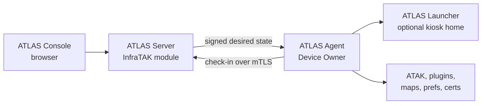
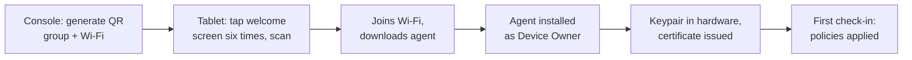

# Introducing ATLAS

2026-09-19 · @Someone

## What ATLAS is

ATLAS (ATAK Tactical Lifecycle & Administration System) is a self-hosted mobile device manager for Android tablets and handsets running ATAK. You run it on your own server next to your TAK Server, enroll an Android device by scanning a QR code, and from then on the device installs the apps, maps, plugins and settings you assign to it, even when it only has a network connection some of the time.

It is built for teams that stand up their own TAK infrastructure and want the same control over their devices: no cloud MDM subscription, no managed Google Play, no per-device licence, and no data leaving your network. It ships as a module of InfraTAK, so if you already run a TAK Server through InfraTAK, ATLAS installs from the same console.

ATLAS is a general-purpose Android MDM at its core. ATAK support is a first-class policy pack layered on top, not the only thing it can do.

## The problem it solves

Setting up an ATAK device by hand means sideloading the APK, installing plugins, copying map packs and DTED into the right folders, importing the server certificate and preferences, and locking down the tablet so a user cannot break it. Repeat that for fifty devices and it is a week of work, and every device drifts from the next one within a month.

Commercial MDMs solve the fleet problem but assume a cloud tenant, managed Google Play and a per-seat subscription. Most of them treat a policy as one big profile per use case, so the moment a tablet needs a different password rule or a second app you are copying and editing whole profiles.

ATLAS starts from the constraints TAK teams actually have:

- **No Google account on the device.** Apps are sideloaded APK and XAPK files you upload to your own server.
- **Unreliable connectivity.** A device that is dark for three weeks must catch up in one check-in, not replay a backlog of commands.
- **Small, composable policies.** A password rule, an app catalog and a Wi-Fi network are separate policies you stack on a device, a group or a tag. ATLAS merges them and tells you exactly which policy set each value.
- **Your own hardware.** Any Android device that supports Device Owner mode. Samsung's rugged and enterprise lines are the primary target, and Samsung Knox integration is on the roadmap.

## How it works

ATLAS has three parts: a server you host, an agent that runs on each device as Android Device Owner, and an optional home screen the agent can install when a policy asks for a kiosk.

The console is where you work. The agent does the work on the device. The server sits between them and holds the single source of truth for what each device should look like.

**The server** runs in Docker on the same box as your TAK Server, installed as an InfraTAK module. It stores your policies, your app library and your content files, resolves what each device should have, and serves it. Devices talk to it only over mutual TLS on its own port, with a certificate the server issued to that device. Admins reach the console on a separate port behind InfraTAK's login.

**The agent** is a small Kotlin app that becomes the device's owner during out-of-box setup. Device Owner is the strongest management mode Android offers: it can silently install and update apps, set passwords, lock the device to one app, configure Wi-Fi, place files, and restrict features, all without a Google account. It uses only standard Android management APIs today, so it behaves the same on every manufacturer's hardware.

**Policies** are the unit of everything. Each policy is a set of categories you fill in only as far as you need: password, restrictions, app catalog, networks, files, kiosk, wallpaper, ATAK config, tracking and geofencing, breach mode, data use, customizations. You assign a policy to a device, a group or a tag with a rank. The server merges every policy reaching a device field by field, and for every value it can tell you which policy set it and what was overridden. A stricter rule always wins for restrictions and password length, lists accumulate, and where two policies simply disagree the higher rank wins and the console flags the conflict.

**Desired state, not a command stream.** On each check-in the device reports the version it holds. If the server has a newer one it replies with a single signed document describing everything the device should have: apps with their file hashes and download URLs, files and where they go, settings, restrictions. The agent diffs that against reality and converges. A device that was dark for three weeks receives one document and catches up. Between check-ins the agent parks on a long-poll, so a policy edit in the console wakes the affected devices within a second when they are online, and polling still catches them when they are not.

**Apps and content** are uploaded to the server once. It reads the package name, version and signing certificate from the APK or XAPK itself, unpacks split packages, and refuses an upload that could not install in the field, such as a mismatched signing key. Downloads resume where they dropped. A files policy places map packs, DTED, preference files and certificates into ATAK's folders, extracting archives if you tell it to. Files and apps can be required, or offered in an on-device store where the user picks what to install.

## Enrolling a device

Enrollment takes about two minutes per device and needs nothing on the device beforehand. It must start from a factory-reset state, because Android only lets an app become Device Owner during the setup wizard.

1. On the Enroll page, pick the group the device should join and enter the Wi-Fi network it should use during setup. Generate the QR.
2. By default the QR expires in 15 minutes, so a photograph of it stops working quickly. You can instead make a permanent QR to print and leave on a provisioning bench for bulk onboarding, and retire it later with one click.
3. On the factory-reset device, tap the welcome screen six times to open the QR scanner and scan the code.
4. The device joins Wi-Fi, downloads the agent from your server, installs it as Device Owner, and walks through the permissions it needs.
5. The agent generates a key pair inside the device's secure hardware, sends a certificate request to the server, and receives a client certificate. Every later connection uses that certificate, so there is no login token to expire while the device is in the field.
6. The device appears on the Manage page within seconds and applies the policies of the group it joined on its first check-in. Nothing else to do.

A device that is wiped and re-enrolled is recognised as the same record, so its name, group and history come back with it.

## Day to day in the console

The console is a plain web app with eight sections. There is no build step and no client framework, so it loads fast on a laptop tethered to a phone in the field.

| Section | What you do there |
| --- | --- |
| Enroll | Generate QR codes, choose the group a device lands in, manage and retire enrollment tokens |
| Manage | Fleet list and the per-device page: name it, move it between groups, see what it applied and when, lock, locate, collect logs, check in now, disenroll |
| Policies | Build policies with typed forms, stack them on devices, groups and tags, preview the merged result before you save |
| Apps | Upload APK and XAPK files, or fetch a build from Google Play through one nominated account, and curate storefronts users can pick from |
| Content | Upload map packs, DTED, preference files, certificates and archives for file policies to place |
| Reports | Point-in-time views over the fleet, each downloadable as CSV |
| Admin | Console users, email alerts, SMTP, breach mode configuration, retention |
| Guides | Built-in how-tos and an FAQ, versioned with the release |

A few things that matter once a fleet is real:

- **Stacking is explainable.** Open any device and every effective setting names the policy that set it and what it overrode. When two policies disagree, the console shows the conflict instead of silently picking one.
- **Location and geofencing.** Devices report position on a schedule you set. Draw a fence and get an alert when a device leaves it, and the device page shows a map and history.
- **Alerts by email.** Enrollment, disenrollment, a device that stopped applying its policy, or a device that has been quiet for 90 minutes or 14 days, whichever you choose. ATLAS can send through InfraTAK's own mail settings.
- **Breach mode.** One button for a device in the wrong hands. It removes every app in your library, empties the folders you named, locks the device with a passcode you chose, and reports its position every minute. It is deliberately not a factory reset, because a wiped device stops telling you where it is.
- **Kiosk.** Lock a device to ATAK, or to a small set of apps using the ATLAS launcher, and release it by editing the policy. No physical access is needed to undo a lockdown.
- **Identification.** A device ID label and a wallpaper make one tablet in a rack of identical tablets recognisable without unlocking it.

## Coming next: Samsung Knox

Knox integration is in progress and not yet part of a release. Everything above works without it, and it will stay that way: Knox is additive, never required, and a non-Samsung device or an unlicensed Samsung device keeps working exactly as it does today.

The licensing is better than most people expect. Samsung's Knox Platform for Enterprise Premium is now free. An operator generates their own licence key in the Knox Admin Portal, pastes it into the ATLAS console, and the agent activates it on each Samsung device. No Samsung partnership, no reseller, no Google.

What Knox will add, chosen from the parts of Knox that standard Android has no answer for:

- **Per-app firewall.** Allow, deny or redirect traffic by app, block domains, and report what was blocked. The single biggest gain for a device that must only ever talk to your TAK Server.
- **Per-app VPN routing.** Send ATAK through the tunnel and leave everything else off it.
- **Finer restrictions.** USB exceptions by device class, Settings lockdown, and control of the microphone, camera, headphone jack and home key beyond what Android's user restrictions allow.
- **Enterprise Wi-Fi done properly.** EAP networks with certificates, replacing the limited Wi-Fi configuration API the plain build is confined to.
- **Remote certificate enrollment.** SCEP-style issuance on the device, which maps directly onto TAK client certificates.
- **Hardware-rooted attestation.** Proof that a device is genuine and unmodified before it is issued an identity.
- **Forensic event logs** pulled off the device, and a battery-optimisation allow-list so the agent and ATAK are never put to sleep.
- **Knox Mobile Enrollment.** Enrollment that survives a factory reset, for fleets that already use it.

The roadmap deliberately skips Knox features that duplicate something Android Enterprise already does, because Samsung is retiring those and building on them would break under us.

## Getting it

ATLAS installs from the InfraTAK console. Open InfraTAK on your server, pick the ATLAS module, and it clones the current release, builds the container on the box, runs the database migrations and loads the bundled agent and launcher into the app library. Updates work the same way: the console tells you when a newer release exists and installs it on request. Do not clone the repository and run it by hand, because that skips the steps that make it work.

|  |  |
| --- | --- |
| Current release | 1.52.1 |
| Source | [github.com/cfd2474/TAK-MDM](https://github.com/cfd2474/TAK-MDM) |
| Installs through | [InfraTAK](https://github.com/takwerx/infra-TAK) |
| Licence | Apache 2.0, by TAK-Solutions LLC |
| Security reports | takwerx@gmail.com, not a public issue |

### Ports and DNS

ATLAS needs one DNS name and one extra open port beyond what InfraTAK already uses. The installer opens the port in the firewall for you and Caddy, InfraTAK's reverse proxy, obtains the Let's Encrypt certificate. You provide the DNS record.

| What | Port | Who connects | Notes |
| --- | --- | --- | --- |
| Admin console | 443 | You, in a browser | `https://atlas.<your-domain>` behind InfraTAK's Authentik login, on the same 443 every InfraTAK service shares |
| Device channel | 8449 | Enrolled devices | Mutual TLS. A connection without a device certificate issued by your ATLAS is refused before it reaches the application |
| Agent download | 80 | A factory-reset device during setup | Plain HTTP on purpose: the setup wizard has no ATLAS trust yet and verifies the download against the signature checksum carried in the QR |

- **DNS.** Create an A record for `atlas.<your-domain>` pointing at the server's public IP, alongside the records you already have for the TAK Server. Caddy requests a certificate for that name as soon as it resolves. Without a resolvable name ATLAS cannot generate an enrollment QR, because the QR has nowhere to point a device.
- **Firewall.** Ports 80 and 443 are already open on an InfraTAK box. The ATLAS installer adds an allow rule for 8449 on both ufw and firewalld and reports if it could not.
- **Nothing else is reachable.** The ATLAS application listens on loopback only and Caddy is the only thing that talks to it. The database never leaves the box.
- **Devices in the field** need to reach 80 during enrollment and 8449 afterwards. Both must be reachable from wherever the tablets are, whether that is the public internet, a VPN or a private LTE APN.
- **Multi-agency deployments** get one hostname each, in the form `atlas.<agency>.<your-domain>`, and each needs its own DNS record. They share port 8449, because Caddy selects the right agency by hostname during the TLS handshake.

The repository is a release mirror: each tag is one commit with the exact tree an InfraTAK deployment installs, and no development history. The Android agent and launcher ship as signed APKs inside it.

Bug reports, feature requests and field experience are welcome as GitHub issues on that repository. The most useful report names the device model, the One UI or Android version, and what the device page showed.
